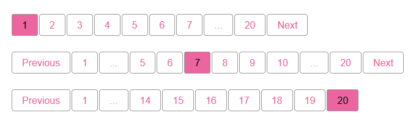
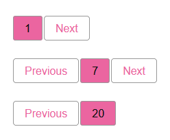

# Pagination Service

The Pagination Service provides a way for building pagination controls easily.

## Table of Contents

- [Getting started](#getting-started)
	- [Requirements](#requirements)
	- [Highlights](#highlights)
    - [Screenshots](#screenshots)
    - [Simple Example](#simple-example)
- [Documentation](#documentation)
    - [Create Pagination](#create-pagination)
    - [Pagination Data](#pagination-data)
    - [Current Page Verification](#current-page-verification)
    - [Render Pagination](#render-pagination)
        - [Menu Renderer](#menu-renderer)
        - [Custom Renderer](#custom-renderer)
    - [Url Generation](#url-generation)
        - [Default Url Generator](#default-url-generator)
        - [Custom Url Generator](#custom-url-generator)
- [Credits](#credits)
___

# Getting started

Add the latest version of the Language service project running this command.

```
composer require tobento/service-language
```

## Requirements

- PHP 8.0 or greater

## Highlights

- Framework-agnostic, will work with any project
- Decoupled design
- Customize rendering
- Customize url generation

## Screenshots

<br/>
<br/>

## Simple Example

```php
use Tobento\Service\Pagination\Pagination;

$pagination = new Pagination(
    totalItems: 200,
    currentPage: 3,
);
```

**Render the pagination**

```php
<?= $pagination->render() ?>

// or just
<?= $pagination ?>
```

# Documentation

## Pagination

### Create Pagination

```php
use Tobento\Service\Pagination\Pagination;
use Tobento\Service\Pagination\PaginationInterface;
use Tobento\Service\Pagination\UrlGenerator;
use Tobento\Service\Pagination\MenuRenderer;

$pagination = new Pagination(
    totalItems: 200,
    currentPage: 3,
    itemsPerPage: 50,
    maxPagesToShow: 10,
    maxItemsPerPage: 1000,
    urlGenerator: (new UrlGenerator())->addPageUrl('#{num}'),
    renderer: new MenuRenderer('prev', 'next'),
);

var_dump($pagination instanceof PaginationInterface);
// bool(true)
```

#### With Methods

You might change some data or implentation by the following "with methods" returning a new instance.

**withCurrentPage**

```php
use Tobento\Service\Pagination\Pagination;

$pagination = new Pagination(totalItems: 200);

$newPagination = $pagination->withCurrentPage(6);

var_dump($pagination === $newPagination);
// bool(false)
```

**withItemsPerPage**

```php
use Tobento\Service\Pagination\Pagination;

$pagination = new Pagination(totalItems: 200);

$newPagination = $pagination->withItemsPerPage(30);

var_dump($pagination === $newPagination);
// bool(false)
```

**withMaxPagesToShow**

```php
use Tobento\Service\Pagination\Pagination;

$pagination = new Pagination(totalItems: 200);

$newPagination = $pagination->withMaxPagesToShow(6);

var_dump($pagination === $newPagination);
// bool(false)
```

**withUrlGenerator**

```php
use Tobento\Service\Pagination\Pagination;
use Tobento\Service\Pagination\UrlGenerator;

$pagination = new Pagination(totalItems: 200);

$newPagination = $pagination->withUrlGenerator(new UrlGenerator());

var_dump($pagination === $newPagination);
// bool(false)
```

**withRenderer**

```php
use Tobento\Service\Pagination\Pagination;
use Tobento\Service\Pagination\MenuRenderer;

$pagination = new Pagination(totalItems: 200);

$newPagination = $pagination->withRenderer(new MenuRenderer());

var_dump($pagination === $newPagination);
// bool(false)
```

### Pagination Data

You might need the following data for a custom renderer, verifying page number or limiting queries.

```php
use Tobento\Service\Pagination\Pagination;
use Tobento\Service\Pagination\PageInterface;

$pagination = new Pagination(
    totalItems: 200,
    currentPage: 3,
    itemsPerPage: 50,
    maxPagesToShow: 10,
);

var_dump($pagination->getTotalItems());
// int(200)

var_dump($pagination->getTotalItemsFrom());
// int(101)

var_dump($pagination->getTotalItemsTo());
// int(150)

var_dump($pagination->getItemsPerPage());
// int(50)

var_dump($pagination->getItemsOffset());
// int(100)

var_dump($pagination->hasPages());
// bool(true)

$pages = $pagination->getPages();
// array<int, PageInterface>

$pages = $pagination->getTotalPages();
// int(4)

var_dump($pagination->hasPage(num: 5));
// bool(false)

var_dump($pagination->hasCurrentPage());
// bool(true)

var_dump($pagination->getCurrentPage());
// int(3)

var_dump($pagination->getPrevPageUrl());
// string(6) "page/2"

var_dump($pagination->getNextPageUrl());
// NULL
```

### Current Page Verification

It is advised to check if the current page exists, especially if you set the current page from user input or based on a url parameter.

```php
use Tobento\Service\Pagination\Pagination;

$pagination = new Pagination(
    totalItems: 200,
    currentPage: 12,
    itemsPerPage: 50,
);

if (! $pagination->hasCurrentPage()) {
    // handle if current page does not exist.
    // redirect, page not found or whatever fits your application design.
    $pagination = $pagination->withCurrentPage(1);
}
```

### Render Pagination

There are different ways of rendering the pagination depending on your needs.

#### Menu Renderer

The menu renderer is the default pagination renderer. It uses the [Menu Service](https://github.com/tobento-ch/service-menu) to generate the pagination HTML.

```php
use Tobento\Service\Pagination\Pagination;
use Tobento\Service\Pagination\MenuRenderer;

$pagination = new Pagination(
    totalItems: 200,
    currentPage: 3,
    itemsPerPage: 30,
    renderer: new MenuRenderer(previousText: 'prev', nextText: 'next'),
);

echo $pagination;
```

Outputs:

```html
<ul class="pagination">
    <li><a href="page/2">prev</a></li>
    <li class="page"><a href="page/1">1</a></li>
    <li class="page"><a href="page/2">2</a></li>
    <li class="current"><span>3</span></li>
    <li class="page"><a href="page/4">4</a></li>
    <li class="page"><a href="page/5">5</a></li>
    <li class="page"><a href="page/6">6</a></li>
    <li class="page"><a href="page/7">7</a></li>
    <li><a href="page/4">next</a></li>
</ul>
```

#### Custom Renderer

You might write your own renderer fitting your application. The following example uses the [View Service](https://github.com/tobento-ch/service-view) to generate the pagination HTML.

```php
use Tobento\Service\Pagination\Pagination;
use Tobento\Service\Pagination\RendererInterface;
use Tobento\Service\Pagination\PaginationInterface;
use Tobento\Service\View\ViewInterface;
use Tobento\Service\View\View;
use Tobento\Service\View\PhpRenderer;
use Tobento\Service\View\Dirs;
use Tobento\Service\View\Dir;
use Tobento\Service\View\Data;
use Tobento\Service\View\Assets;

$view = new View(
    new PhpRenderer(
        new Dirs([
            new Dir('home/private/views/')
        ])
    ),
    new Data(),
    new Assets('home/public/src/', 'https://www.example.com/src/')
);

class ViewRenderer implements RendererInterface
{
    public function __construct(
        private ViewInterface $view,
        private string $viewToRender = 'service/pagination',
    ) {}
    
    public function render(PaginationInterface $pagination): string
    {        
        return $this->view->render(
            $this->viewToRender,
            ['pagination' => $pagination]
        );
    }
}

$pagination = new Pagination(
    totalItems: 500,
    currentPage: 2,
    renderer: new ViewRenderer($view),
);

echo $pagination;
```

***The view template***

```php
<?php if ($pagination->getTotalPages() <= 1) { ?>
    <nav class="pagination">
        <ul class="pagination">    
            <?php if ($pagination->getPrevPageUrl()) { ?>
                <li><a href="<?= $view->esc($pagination->getPrevPageUrl()) ?>">Previous</a></li>
            <?php } ?>

            <?php foreach($pagination->getPages() as $page) { ?>
                <?php if ($page->url() && ! $page->current()) { ?>
                    <li><a href="<?= $view->esc($page->url()) ?>"><?= $view->esc($page->name()) ?></a></li>
                <?php } else { ?>
                    <li><span class="<?= $page->current() ? 'current': '' ?>"><?= $view->esc($page->name()) ?></span></li>
                <?php } ?>
            <?php } ?>

            <?php if ($pagination->getNextPageUrl()) { ?>
                <li><a href="<?= $view->esc($pagination->getNextPageUrl()) ?>">Next</a></li>
            <?php } ?>           
        </ul>
    </nav>
<?php } ?>

<div class="pagination-info">
    <p>
        Showing <?= $view->esc($pagination->getTotalItemsFrom()) ?>
        - <?= $view->esc($pagination->getTotalItemsTo()) ?>
        from <?= $view->esc($pagination->getTotalItems()) ?> records.
    </p>
</div>
```

### Url Generation

#### Default Url Generator

```php
use Tobento\Service\Pagination\Pagination;
use Tobento\Service\Pagination\UrlGenerator;

$urlGenerator = new UrlGenerator();

// url pattern for all pages:
$urlGenerator->addPageUrl(url: 'page/{num}', placeholder: '{num}');

// url pattern for page number 1 only:
$urlGenerator->addPageUrl(url: 'page', placeholder: null, page: 1);


$pagination = new Pagination(
    totalItems: 500,
    currentPage: 3,
    urlGenerator: $urlGenerator,
);

echo $pagination;
```

#### Custom Url Generator

You might write a custom url generator fitting your application design.

```php
use Tobento\Service\Pagination\Pagination;
use Tobento\Service\Pagination\UrlGeneratorInterface;

class CustomUrlGenerator implements UrlGeneratorInterface
{
    /**
     * Generate the url for the specified page number.
     *
     * @param int $pageNumber
     * @return string The generated url.
     */
    public function generate(int $pageNumber): string
    {
        // generate the url for the specified page number.
        return '';
    }
}

$pagination = new Pagination(
    totalItems: 500,
    currentPage: 3,
    urlGenerator: new CustomUrlGenerator(),
);

echo $pagination;
```

# Credits

- [Tobias Strub](https://www.tobento.ch)
- [All Contributors](../../contributors)

Some idea and code snippets is taken from [Jasongrimes php-paginator](https://github.com/jasongrimes/php-paginator).